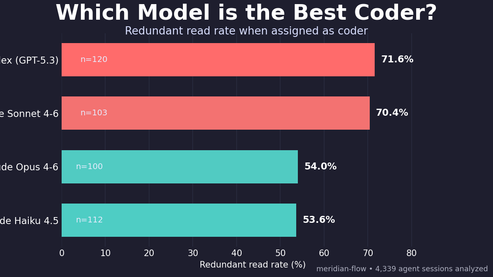
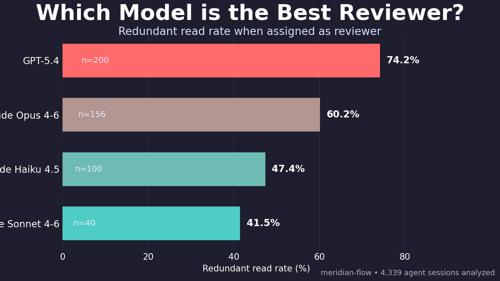
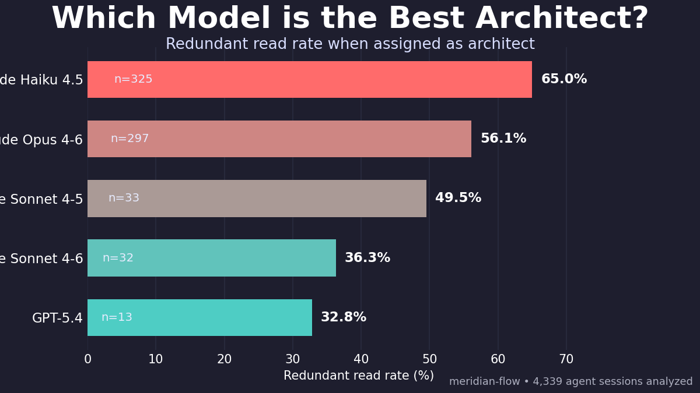
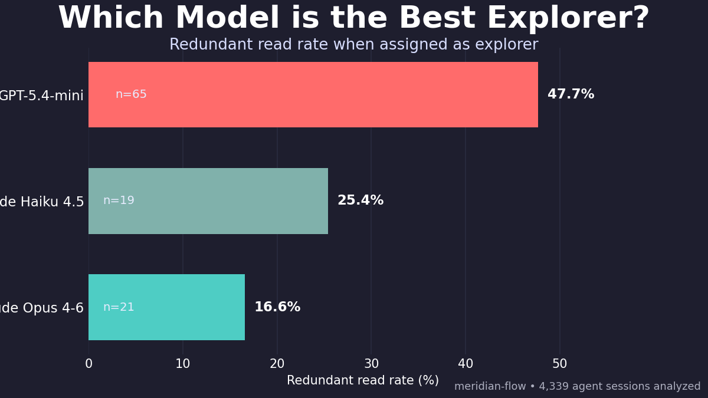

# Model Performance by Role

Which model is best depends entirely on what you ask it to do.

## Coder

Coder performance is tightly clustered at the top end of redundancy: Codex (GPT-5.3) and Claude Sonnet 4-6 are both around 70% redundant reads. Claude Opus 4-6 and Claude Haiku 4.5 are materially better in this role, both near 54%.

## Reviewer

Reviewer shows the biggest spread among major-model sample sizes: GPT-5.4 is highest redundancy, while Claude Sonnet 4-6 is lowest. Opus and Haiku sit in the middle, so model choice clearly changes review efficiency.

## Architect

Architect has the largest sample sizes and a wide range: Claude Haiku 4.5 is highest redundancy, while GPT-5.4 and Claude Sonnet 4-6 are much lower. Even within one role, the model ranking is not the same as global ranking.

## Explorer

Explorer flips the narrative from coder/reviewer: GPT-5.4-mini is highest redundancy, while Claude Opus 4-6 is lowest by a large margin. This is a strong role-specific effect, not a universal “best model” result.

## Key Takeaway

A single “best model” chart is really mixing different jobs together. Once you control for role, model performance changes meaningfully—and sometimes reverses.
